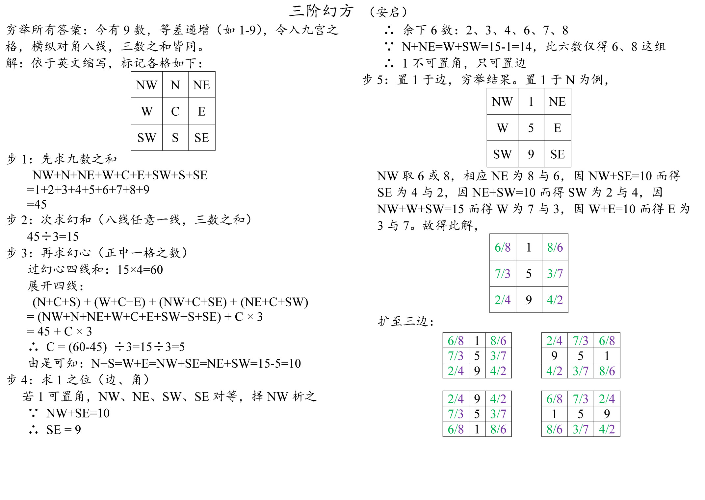

  

盒子

		<a target="_blank" href="box/box.htm">单个盒子</a> 
		<a target="_blank" href="box/box_new.htm">新版盒子</a> 
		<a target="_blank" href="box/box_single_file.htm">单个盒子2</a> 
		<a target="_blank" href="box/cuboid_with_square_section_a3.htm">A3常规快递盒</a> 
		<a target="_blank" href="box/cuboid_with_square_section_a3.min.htm">A3常规快递盒（代码已压缩）</a> 
		<a target="_blank" href="box/express_box_a3_use_page.htm">A3快递盒（普通标记）</a> 
		<a target="_blank" href="box/express_box_a3_use_svg.htm">A3快递盒（svg标记）</a> 
		<a target="_blank" href="box/express_box_a4_use_svg_240210.htm">A4快递盒（svg标记，调整中）</a> 
		<a target="_blank" href="box/express_boxes_and_dices_a3_use_page.htm">A3快递盒混搭骰子（普通标记）</a> 
		<a target="_blank" href="box/express_boxes_and_dices_a3_use_svg.htm">快递盒混搭骰子（svg标记）</a> 
  

  

骰子

		<a target="_blank" href="dice/dices_10_faces.htm">十面骰子</a> 
		<a target="_blank" href="dice/dices_a3.htm">A3各种骰子</a> 
  

  

手写日志小册子

		<a target="_blank" href="logger/logger.htm">风格1：无需裁切，需装订</a> 
		<a target="_blank" href="logger/logger_notNeedCut.htm">风格1：无需裁切，需装订</a> 
		<a target="_blank" href="logger/logger1.htm">风格2：需裁切，不需装订</a> 

    

      
页面参数

      <ol>
        <li>name：文件名及右页眉</li>
        <li>left：左页眉</li>
        <li>start：起始页（可能被自动修正）</li>
        <li>end：结束页（可能被自动修正）</li>
        <li>vLine：true，中有竖线；false，中无竖线</li>
        <li>withoutLineNo：true，无行号；false，带行号</li>
      </ol>
    

  

  

数学练习

		 
		<a target="_blank" href="math_exercise/grade2_term2_summer_holiday.htm">二下暑假</a> 
		<a target="_blank" href="math_exercise/grade3_term1.htm">三上</a> 
		<a target="_blank" href="math_exercise/grade3_term1_winter_holiday.htm">三上（寒假复习）</a> 
		<a target="_blank" href="math_exercise/grade3_term1_winter_holiday_basic.htm">三上基础版（寒假复习）</a> 
		<a target="_blank" href="math_exercise/grade3_term2_phase1.htm">三下阶段1</a> 
		<a target="_blank" href="math_exercise/grade3_term2_phase2.htm">三下阶段2</a> 
		<a target="_blank" href="math_exercise/grade3_term2_phase3.htm">三下阶段3</a> 
		<a target="_blank" href="math_exercise/grade3_term2_weekend.htm">三下周末练</a> 

    

      
页面参数

      <ol>
        <li>start：开始日期</li>
        <li>end：结束日期</li>
        <li>left：左边距</li>
        <li>right：右边距</li>
        <li>top：上边距</li>
        <li>bottom：下边距</li>
        <li>notrim：true，无需切边；false，需切边</li>
        <li>removeCover：true，保留封面；false，去除封面</li>
        <li>oralMax：口算最大值（可能被自动修正）</li>
        <li>verticalMax：列竖式最大值（可能被自动修正）</li>
        <li>offTheShelfMax：脱式计算最大值（可能被自动修正）</li>
      </ol>
    

  

  

迷你扑克

		<a target="_blank" href="mini_poker/math.htm?lang=en_us&no=1&useDice=true">带骰子，20內進位加，英文版</a> 
		<a target="_blank" href="mini_poker/math.htm?lang=en_us&no=2&useDice=true">带骰子，20內退位减，英文版</a> 
		<a target="_blank" href="mini_poker/math.htm?lang=en_us&no=3&useDice=true">带骰子，大九九乘法口訣表，英文版</a> 
		<a target="_blank" href="mini_poker/math.htm?lang=zh_cn&no=1&useDice=true">带骰子，20內進位加，简体中文版</a> 
		<a target="_blank" href="mini_poker/math.htm?lang=zh_cn&no=2&useDice=true">带骰子，20內退位减，简体中文版</a> 
		<a target="_blank" href="mini_poker/math.htm?lang=zh_cn&no=3&useDice=true">带骰子，大九九乘法口訣表，简体中文版</a> 
		<a target="_blank" href="mini_poker/math.htm?lang=zh_tw&no=1&useDice=true">带骰子，20內進位加，繁体中文版</a> 
		<a target="_blank" href="mini_poker/math.htm?lang=zh_tw&no=2&useDice=true">带骰子，20內退位减，繁体中文版</a> 
		<a target="_blank" href="mini_poker/math.htm?lang=zh_tw&no=3&useDice=true">带骰子，大九九乘法口訣表，繁体中文版</a> 
		<a target="_blank" href="mini_poker/math.htm?lang=&no=1&useDice=true">带骰子，20內進位加，</a> 
		<a target="_blank" href="mini_poker/math.htm?lang=&no=2&useDice=true">带骰子，20內退位减，</a> 
		<a target="_blank" href="mini_poker/math.htm?lang=&no=3&useDice=true">带骰子，大九九乘法口訣表，</a> 
		<a target="_blank" href="mini_poker/math.htm?lang=英文版&no=1&useDice=true">带骰子，20內進位加，</a> 
		<a target="_blank" href="mini_poker/math.htm?lang=英文版&no=2&useDice=true">带骰子，20內退位减，</a> 
		<a target="_blank" href="mini_poker/math.htm?lang=英文版&no=3&useDice=true">带骰子，大九九乘法口訣表，</a> 
		<a target="_blank" href="mini_poker/math.htm?lang=简体中文版&no=1&useDice=true">带骰子，20內進位加，</a> 
		<a target="_blank" href="mini_poker/math.htm?lang=简体中文版&no=2&useDice=true">带骰子，20內退位减，</a> 
		<a target="_blank" href="mini_poker/math.htm?lang=简体中文版&no=3&useDice=true">带骰子，大九九乘法口訣表，</a> 
		<a target="_blank" href="mini_poker/math.htm?lang=繁体中文版&no=1&useDice=true">带骰子，20內進位加，</a> 
		<a target="_blank" href="mini_poker/math.htm?lang=繁体中文版&no=2&useDice=true">带骰子，20內退位减，</a> 
		<a target="_blank" href="mini_poker/math.htm?lang=繁体中文版&no=3&useDice=true">带骰子，大九九乘法口訣表，</a> 
		<a target="_blank" href="mini_poker/math.htm?lang=en_us&no=1&useDice=false">无骰子，20內進位加，英文版</a> 
		<a target="_blank" href="mini_poker/math.htm?lang=en_us&no=2&useDice=false">无骰子，20內退位减，英文版</a> 
		<a target="_blank" href="mini_poker/math.htm?lang=en_us&no=3&useDice=false">无骰子，大九九乘法口訣表，英文版</a> 
		<a target="_blank" href="mini_poker/math.htm?lang=zh_cn&no=1&useDice=false">无骰子，20內進位加，简体中文版</a> 
		<a target="_blank" href="mini_poker/math.htm?lang=zh_cn&no=2&useDice=false">无骰子，20內退位减，简体中文版</a> 
		<a target="_blank" href="mini_poker/math.htm?lang=zh_cn&no=3&useDice=false">无骰子，大九九乘法口訣表，简体中文版</a> 
		<a target="_blank" href="mini_poker/math.htm?lang=zh_tw&no=1&useDice=false">无骰子，20內進位加，繁体中文版</a> 
		<a target="_blank" href="mini_poker/math.htm?lang=zh_tw&no=2&useDice=false">无骰子，20內退位减，繁体中文版</a> 
		<a target="_blank" href="mini_poker/math.htm?lang=zh_tw&no=3&useDice=false">无骰子，大九九乘法口訣表，繁体中文版</a> 
		<a target="_blank" href="mini_poker/math.htm?lang=&no=1&useDice=false">无骰子，20內進位加，</a> 
		<a target="_blank" href="mini_poker/math.htm?lang=&no=2&useDice=false">无骰子，20內退位减，</a> 
		<a target="_blank" href="mini_poker/math.htm?lang=&no=3&useDice=false">无骰子，大九九乘法口訣表，</a> 
		<a target="_blank" href="mini_poker/math.htm?lang=英文版&no=1&useDice=false">无骰子，20內進位加，</a> 
		<a target="_blank" href="mini_poker/math.htm?lang=英文版&no=2&useDice=false">无骰子，20內退位减，</a> 
		<a target="_blank" href="mini_poker/math.htm?lang=英文版&no=3&useDice=false">无骰子，大九九乘法口訣表，</a> 
		<a target="_blank" href="mini_poker/math.htm?lang=简体中文版&no=1&useDice=false">无骰子，20內進位加，</a> 
		<a target="_blank" href="mini_poker/math.htm?lang=简体中文版&no=2&useDice=false">无骰子，20內退位减，</a> 
		<a target="_blank" href="mini_poker/math.htm?lang=简体中文版&no=3&useDice=false">无骰子，大九九乘法口訣表，</a> 
		<a target="_blank" href="mini_poker/math.htm?lang=繁体中文版&no=1&useDice=false">无骰子，20內進位加，</a> 
		<a target="_blank" href="mini_poker/math.htm?lang=繁体中文版&no=2&useDice=false">无骰子，20內退位减，</a> 
		<a target="_blank" href="mini_poker/math.htm?lang=繁体中文版&no=3&useDice=false">无骰子，大九九乘法口訣表，</a> 
    <a target="_blank" href="mini_poker/math.min.htm">数学迷你扑克（代码已压缩）</a> 
  

  

    
Others

  	
  

  另一网站是<a target="_blank" href="http://edu.sonya.cc/">http://edu.sonya.cc/</a>，相应源码网址：<a target="_blank" href="https://github.com/edu-sonya-cc/">https://github.com/edu-sonya-cc/</a>。 
