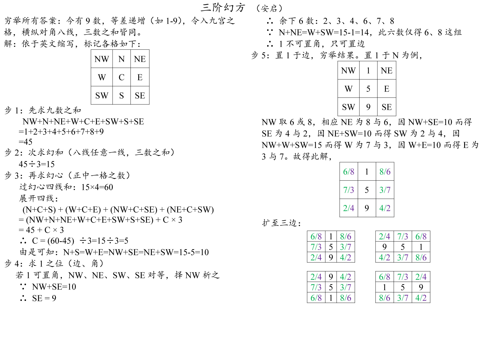

  

    
盒子

		<a target="_blank" href="https://anqisoft.github.io/box/box.htm">單個盒子</a> 
		<a target="_blank" href="https://anqisoft.github.io/box/box_new.htm">新版盒子</a> 
		<a target="_blank" href="https://anqisoft.github.io/box/box_single_file.htm">單個盒子2</a> 
		<a target="_blank" href="https://anqisoft.github.io/box/cuboid_with_square_section_a3.htm">A3常規快遞盒</a> 
		<a target="_blank" href="https://anqisoft.github.io/box/cuboid_with_square_section_a3.min.htm">A3常規快遞盒（代碼已壓縮）</a> 
		<a target="_blank" href="https://anqisoft.github.io/box/express_box_a3_use_page.htm">A3快遞盒（普通標記）</a> 
		<a target="_blank" href="https://anqisoft.github.io/box/express_box_a3_use_svg.htm">A3快遞盒（svg標記）</a> 
		<a target="_blank" href="https://anqisoft.github.io/box/express_box_a4_use_svg_240210.htm">A4快遞盒（svg標記，調整中）</a> 
		<a target="_blank" href="https://anqisoft.github.io/box/express_boxes_and_dices_a3_use_page.htm">A3快遞盒混搭骰子（普通標記）</a> 
		<a target="_blank" href="https://anqisoft.github.io/box/express_boxes_and_dices_a3_use_svg.htm">快遞盒混搭骰子（svg標記）</a> 
  

  

骰子

		<a target="_blank" href="https://anqisoft.github.io/dice/dices_10_faces.htm">十面骰子</a> 
		<a target="_blank" href="https://anqisoft.github.io/dice/dices_a3.htm">A3各種骰子</a> 
  

  

手寫日誌小冊子

		<a target="_blank" href="https://anqisoft.github.io/logger/logger.htm">風格1：無需裁切，需裝訂</a> 
		<a target="_blank" href="https://anqisoft.github.io/logger/logger_notNeedCut.htm">風格1：無需裁切，需裝訂</a> 
		<a target="_blank" href="https://anqisoft.github.io/logger/logger1.htm">風格2：需裁切，不需裝訂</a> 
    

      
頁面參數

      <ol>
        <li>name：文件名及右頁眉</li>
        <li>left：左頁眉</li>
        <li>start：起始頁（可能被自動修正）</li>
        <li>end：結束頁（可能被自動修正）</li>
        <li>vLine：true，中有豎線；false，中無豎線</li>
        <li>withoutLineNo:true，無行號；false，帶行號</li>
      </ol>
		

  

  

數學練習

		 
		<a target="_blank" href="https://anqisoft.github.io/math_exercise/grade2_term2_summer_holiday.htm">二下暑假</a> 
		<a target="_blank" href="https://anqisoft.github.io/math_exercise/grade3_term1.htm">三上</a> 
		<a target="_blank" href="https://anqisoft.github.io/math_exercise/grade3_term1_winter_holiday.htm">三上（寒假複習）</a> 
		<a target="_blank" href="https://anqisoft.github.io/math_exercise/grade3_term1_winter_holiday_basic.htm">三上基礎版（寒假複習）</a> 
		<a target="_blank" href="https://anqisoft.github.io/math_exercise/grade3_term2_phase1.htm">三下階段1</a> 
		<a target="_blank" href="https://anqisoft.github.io/math_exercise/grade3_term2_phase2.htm">三下階段2</a> 
		<a target="_blank" href="https://anqisoft.github.io/math_exercise/grade3_term2_phase3.htm">三下階段3</a> 
		<a target="_blank" href="https://anqisoft.github.io/math_exercise/grade3_term2_weekend.htm">三下週末練</a> 

    

      
頁面參數

      <ol>
        <li>start：開始日期</li>
        <li>end：結束日期</li>
        <li>left：左邊距</li>
        <li>right：右邊距</li>
        <li>top：上邊距</li>
        <li>bottom：下邊距</li>
        <li>notrim：true，無需切邊；false，需切邊</li>
        <li>removeCover：true，保留封面；false，去除封面</li>
        <li>oralMax：口算最大值（可能被自動修正）</li>
        <li>verticalMax：列豎式最大值（可能被自動修正）</li>
        <li>offTheShelfMax：脫式計算最大值（可能被自動修正）</li>
      </ol>
		

  

  

迷你撲克

		<a target="_blank" href="https://anqisoft.github.io/mini_poker/math.htm?lang=en_us&no=1&useDice=true">帶骰子，20內進位加，英文版</a> 
		<a target="_blank" href="https://anqisoft.github.io/mini_poker/math.htm?lang=en_us&no=2&useDice=true">帶骰子，20內退位減，英文版</a> 
		<a target="_blank" href="https://anqisoft.github.io/mini_poker/math.htm?lang=en_us&no=3&useDice=true">帶骰子，大九九乘法口訣表，英文版</a> 
		<a target="_blank" href="https://anqisoft.github.io/mini_poker/math.htm?lang=zh_cn&no=1&useDice=true">帶骰子，20內進位加，簡體中文版</a> 
		<a target="_blank" href="https://anqisoft.github.io/mini_poker/math.htm?lang=zh_cn&no=2&useDice=true">帶骰子，20內退位減，簡體中文版</a> 
		<a target="_blank" href="https://anqisoft.github.io/mini_poker/math.htm?lang=zh_cn&no=3&useDice=true">帶骰子，大九九乘法口訣表，簡體中文版</a> 
		<a target="_blank" href="https://anqisoft.github.io/mini_poker/math.htm?lang=zh_tw&no=1&useDice=true">帶骰子，20內進位加，繁體中文版</a> 
		<a target="_blank" href="https://anqisoft.github.io/mini_poker/math.htm?lang=zh_tw&no=2&useDice=true">帶骰子，20內退位減，繁體中文版</a> 
		<a target="_blank" href="https://anqisoft.github.io/mini_poker/math.htm?lang=zh_tw&no=3&useDice=true">帶骰子，大九九乘法口訣表，繁體中文版</a> 
		<a target="_blank" href="https://anqisoft.github.io/mini_poker/math.htm?lang=&no=1&useDice=true">帶骰子，20內進位加，</a> 
		<a target="_blank" href="https://anqisoft.github.io/mini_poker/math.htm?lang=&no=2&useDice=true">帶骰子，20內退位減，</a> 
		<a target="_blank" href="https://anqisoft.github.io/mini_poker/math.htm?lang=&no=3&useDice=true">帶骰子，大九九乘法口訣表，</a> 
		<a target="_blank" href="https://anqisoft.github.io/mini_poker/math.htm?lang=英文版&no=1&useDice=true">帶骰子，20內進位加，</a> 
		<a target="_blank" href="https://anqisoft.github.io/mini_poker/math.htm?lang=英文版&no=2&useDice=true">帶骰子，20內退位減，</a> 
		<a target="_blank" href="https://anqisoft.github.io/mini_poker/math.htm?lang=英文版&no=3&useDice=true">帶骰子，大九九乘法口訣表，</a> 
		<a target="_blank" href="https://anqisoft.github.io/mini_poker/math.htm?lang=简体中文版&no=1&useDice=true">帶骰子，20內進位加，</a> 
		<a target="_blank" href="https://anqisoft.github.io/mini_poker/math.htm?lang=简体中文版&no=2&useDice=true">帶骰子，20內退位減，</a> 
		<a target="_blank" href="https://anqisoft.github.io/mini_poker/math.htm?lang=简体中文版&no=3&useDice=true">帶骰子，大九九乘法口訣表，</a> 
		<a target="_blank" href="https://anqisoft.github.io/mini_poker/math.htm?lang=繁体中文版&no=1&useDice=true">帶骰子，20內進位加，</a> 
		<a target="_blank" href="https://anqisoft.github.io/mini_poker/math.htm?lang=繁体中文版&no=2&useDice=true">帶骰子，20內退位減，</a> 
		<a target="_blank" href="https://anqisoft.github.io/mini_poker/math.htm?lang=繁体中文版&no=3&useDice=true">帶骰子，大九九乘法口訣表，</a> 
		<a target="_blank" href="https://anqisoft.github.io/mini_poker/math.htm?lang=en_us&no=1&useDice=false">無骰子，20內進位加，英文版</a> 
		<a target="_blank" href="https://anqisoft.github.io/mini_poker/math.htm?lang=en_us&no=2&useDice=false">無骰子，20內退位減，英文版</a> 
		<a target="_blank" href="https://anqisoft.github.io/mini_poker/math.htm?lang=en_us&no=3&useDice=false">無骰子，大九九乘法口訣表，英文版</a> 
		<a target="_blank" href="https://anqisoft.github.io/mini_poker/math.htm?lang=zh_cn&no=1&useDice=false">無骰子，20內進位加，簡體中文版</a> 
		<a target="_blank" href="https://anqisoft.github.io/mini_poker/math.htm?lang=zh_cn&no=2&useDice=false">無骰子，20內退位減，簡體中文版</a> 
		<a target="_blank" href="https://anqisoft.github.io/mini_poker/math.htm?lang=zh_cn&no=3&useDice=false">無骰子，大九九乘法口訣表，簡體中文版</a> 
		<a target="_blank" href="https://anqisoft.github.io/mini_poker/math.htm?lang=zh_tw&no=1&useDice=false">無骰子，20內進位加，繁體中文版</a> 
		<a target="_blank" href="https://anqisoft.github.io/mini_poker/math.htm?lang=zh_tw&no=2&useDice=false">無骰子，20內退位減，繁體中文版</a> 
		<a target="_blank" href="https://anqisoft.github.io/mini_poker/math.htm?lang=zh_tw&no=3&useDice=false">無骰子，大九九乘法口訣表，繁體中文版</a> 
		<a target="_blank" href="https://anqisoft.github.io/mini_poker/math.htm?lang=&no=1&useDice=false">無骰子，20內進位加，</a> 
		<a target="_blank" href="https://anqisoft.github.io/mini_poker/math.htm?lang=&no=2&useDice=false">無骰子，20內退位減，</a> 
		<a target="_blank" href="https://anqisoft.github.io/mini_poker/math.htm?lang=&no=3&useDice=false">無骰子，大九九乘法口訣表，</a> 
		<a target="_blank" href="https://anqisoft.github.io/mini_poker/math.htm?lang=英文版&no=1&useDice=false">無骰子，20內進位加，</a> 
		<a target="_blank" href="https://anqisoft.github.io/mini_poker/math.htm?lang=英文版&no=2&useDice=false">無骰子，20內退位減，</a> 
		<a target="_blank" href="https://anqisoft.github.io/mini_poker/math.htm?lang=英文版&no=3&useDice=false">無骰子，大九九乘法口訣表，</a> 
		<a target="_blank" href="https://anqisoft.github.io/mini_poker/math.htm?lang=简体中文版&no=1&useDice=false">無骰子，20內進位加，</a> 
		<a target="_blank" href="https://anqisoft.github.io/mini_poker/math.htm?lang=简体中文版&no=2&useDice=false">無骰子，20內退位減，</a> 
		<a target="_blank" href="https://anqisoft.github.io/mini_poker/math.htm?lang=简体中文版&no=3&useDice=false">無骰子，大九九乘法口訣表，</a> 
		<a target="_blank" href="https://anqisoft.github.io/mini_poker/math.htm?lang=繁体中文版&no=1&useDice=false">無骰子，20內進位加，</a> 
		<a target="_blank" href="https://anqisoft.github.io/mini_poker/math.htm?lang=繁体中文版&no=2&useDice=false">無骰子，20內退位減，</a> 
		<a target="_blank" href="https://anqisoft.github.io/mini_poker/math.htm?lang=繁体中文版&no=3&useDice=false">無骰子，大九九乘法口訣表，</a> 
    <a target="_blank" href="https://anqisoft.github.io/mini_poker/math.min.htm">數學迷你撲克（代碼已壓縮）</a> 
  

  

    
Others

    
  

  另一網站是<a target="_blank" href="http://edu.sonya.cc/">http://edu.sonya.cc/</a>，相應源碼網址：<a target="_blank" href="https://github.com/edu-sonya-cc/">https://github.com/edu-sonya-cc/</a>。 